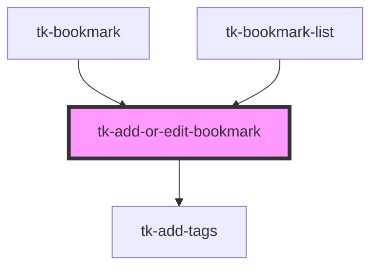

# tk-add-or-edit-bookmark

<!-- Auto Generated Below -->

## Properties

| Property         | Attribute          | Description | Type      | Default     |
| ---------------- | ------------------ | ----------- | --------- | ----------- |
| `bookmark`       | `bookmark`         |             | `any`     | `undefined` |
| `forNewBookmark` | `for-new-bookmark` |             | `boolean` | `undefined` |

## Events

| Event                       | Description | Type               |
| --------------------------- | ----------- | ------------------ |
| `addBookmarkSuccess`        |             | `CustomEvent<any>` |
| `notifyUpdateRequestObject` |             | `CustomEvent<any>` |

## Dependencies

### Used by

 - [tk-bookmark](../tk-bookmark)
 - [tk-bookmark-list](../tk-bookmark-list)

### Depends on

- [tk-add-tags](../../common/tk-add-tags)

### Graph

----------------------------------------------

*Built with [StencilJS](https://stenciljs.com/)*
