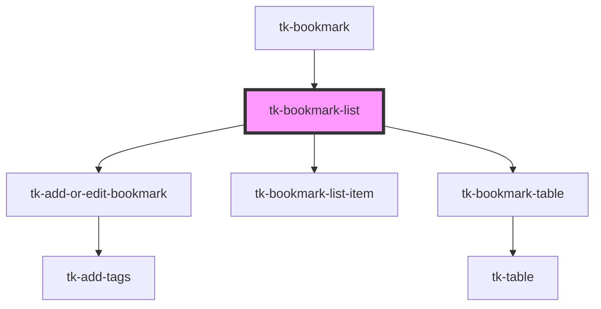

# tk-bookmark-list

<!-- Auto Generated Below -->

## Events

| Event                   | Description | Type               |
| ----------------------- | ----------- | ------------------ |
| `deleteBookmarkSuccess` |             | `CustomEvent<any>` |
| `updateBookmarkSuccess` |             | `CustomEvent<any>` |

## Methods

### `reloadBookmarkList() => Promise<void>`

#### Returns

Type: `Promise<void>`

### `setLabelFilterList(list: any) => Promise<void>`

#### Returns

Type: `Promise<void>`

## Dependencies

### Used by

 - [tk-bookmark](../tk-bookmark)

### Depends on

- [tk-add-or-edit-bookmark](../tk-add-or-edit-bookmark)
- [tk-bookmark-list-item](../tk-bookmark-list-item)
- [tk-bookmark-table](../tk-bookmark-table)

### Graph

----------------------------------------------

*Built with [StencilJS](https://stenciljs.com/)*
