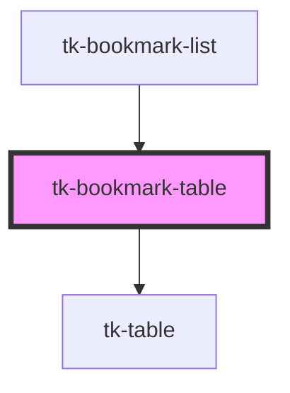

# tk-bookmark-table

<!-- Auto Generated Below -->

## Properties

| Property          | Attribute | Description | Type    | Default |
| ----------------- | --------- | ----------- | ------- | ------- |
| `staticTableData` | --        |             | `any[]` | `[]`    |

## Dependencies

### Used by

 - [tk-bookmark-list](../tk-bookmark-list)

### Depends on

- [tk-table](../../common/tk-table)

### Graph

----------------------------------------------

*Built with [StencilJS](https://stenciljs.com/)*
