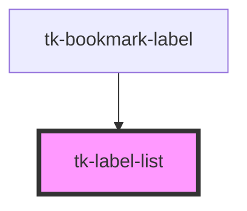

# tk-label-list

<!-- Auto Generated Below -->

## Properties

| Property     | Attribute      | Description | Type      | Default |
| ------------ | -------------- | ----------- | --------- | ------- |
| `isEditMode` | `is-edit-mode` |             | `boolean` | `false` |

## Events

| Event                  | Description | Type               |
| ---------------------- | ----------- | ------------------ |
| `deleteLabelSuccess`   |             | `CustomEvent<any>` |
| `notifyLabelSelection` |             | `CustomEvent<any>` |
| `updateLabelSuccess`   |             | `CustomEvent<any>` |

## Methods

### `getLabelList() => Promise<any[]>`

#### Returns

Type: `Promise<any[]>`

### `reloadLabelList() => Promise<void>`

#### Returns

Type: `Promise<void>`

### `setLabels(labels: any) => Promise<void>`

#### Returns

Type: `Promise<void>`

## Dependencies

### Used by

 - [tk-bookmark-label](../tk-bookmark-label)

### Graph

----------------------------------------------

*Built with [StencilJS](https://stenciljs.com/)*
