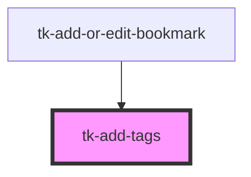

# tk-add-tags

<!-- Auto Generated Below -->

## Properties

| Property        | Attribute       | Description | Type    | Default     |
| --------------- | --------------- | ----------- | ------- | ----------- |
| `currentTags`   | --              |             | `any[]` | `[]`        |
| `existingTags`  | `existing-tags` |             | `any`   | `undefined` |
| `generatedTags` | --              |             | `any[]` | `[]`        |

## Events

| Event              | Description | Type               |
| ------------------ | ----------- | ------------------ |
| `notifyUpdateTags` |             | `CustomEvent<any>` |

## Methods

### `clearTags() => Promise<void>`

#### Returns

Type: `Promise<void>`

### `getTags() => Promise<any[]>`

#### Returns

Type: `Promise<any[]>`

## Dependencies

### Used by

 - [tk-add-or-edit-bookmark](../../bookmark/tk-add-or-edit-bookmark)

### Graph

----------------------------------------------

*Built with [StencilJS](https://stenciljs.com/)*
