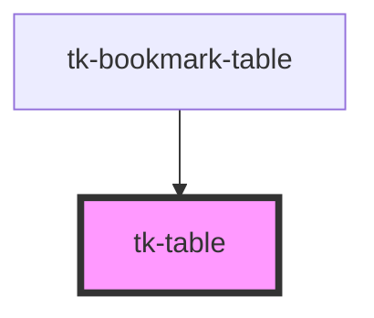

# tk-table

<!-- Auto Generated Below -->

## Properties

| Property    | Attribute | Description | Type    | Default |
| ----------- | --------- | ----------- | ------- | ------- |
| `headers`   | --        |             | `any[]` | `[]`    |
| `tableData` | --        |             | `any[]` | `[]`    |

## Dependencies

### Used by

 - [tk-bookmark-table](../../bookmark/tk-bookmark-table)

### Graph

----------------------------------------------

*Built with [StencilJS](https://stenciljs.com/)*
